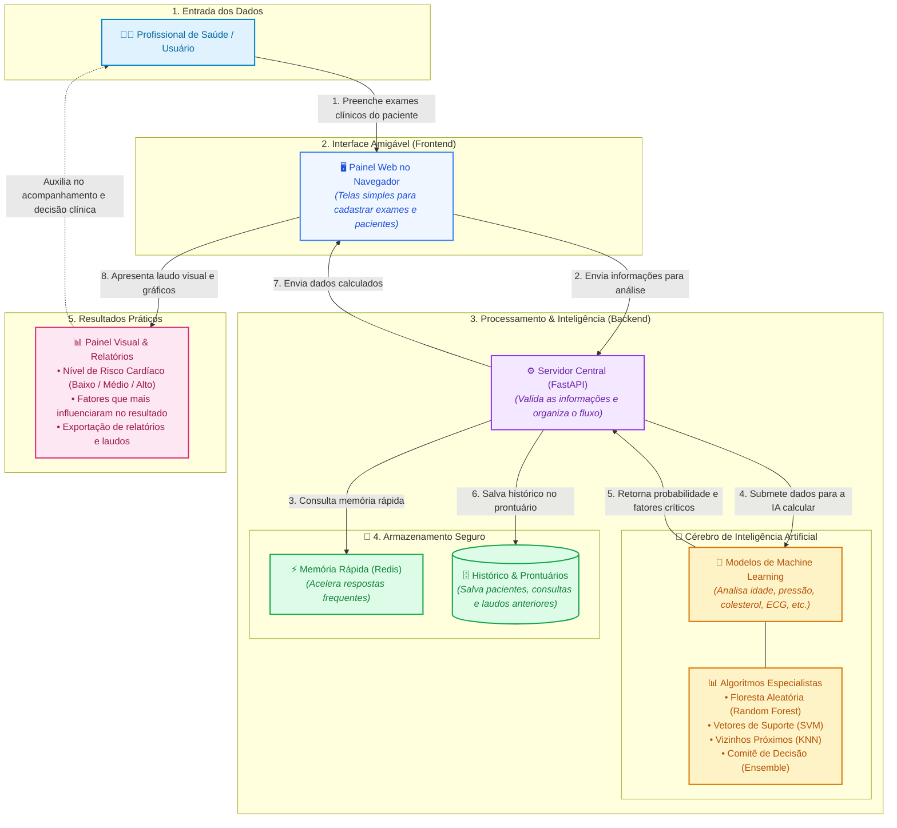

# CardioPredict — Predição de Doença Cardíaca

Sistema completo para avaliação de risco de doença cardíaca utilizando machine learning. Desenvolvido no âmbito do PIBIC (Programa Institucional de Bolsas de Iniciação Científica).

O **código** (variáveis, funções, rotas, banco de dados) usa nomes em **inglês**. A **interface do usuário** é exibida em **português**.

## Funcionalidades

- **Predição de Risco** — ML para classificar risco cardíaco (KNN, SVM, Random Forest, Ensemble)
- **CRUD de Pacientes** — Cadastro e gerenciamento
- **Avaliações** — Registro de predições por paciente
- **Relatórios** — Geração e exportação
- **Dashboard** — Estatísticas e métricas em tempo real
- **Cache via Redis** — Resultados de avaliações em cache para resposta rápida

## 💡 Como Funciona (Arquitetura Simplificada)

O **CardioPredict** foi projetado para transformar dados de exames clínicos em informações visuais claras para apoio à decisão. O diagrama abaixo resume o caminho que a informação percorre de ponta a ponta:



### 🔍 Passo a Passo em Linguagem Simples:

1. **Entrada Clínica:** O profissional de saúde digita os resultados de exames de rotina (idade, pressão arterial, colesterol, glicose, dor no peito, etc.).
2. **Interface Visual (Web):** O sistema oferece telas interativas e intuitivas em português para navegação descomplicada.
3. **Servidor Central:** Recebe os dados, confere se tudo está preenchido corretamente e aciona o módulo inteligente.
4. **Inteligência Artificial (Machine Learning):** Com base no aprendizado com milhares de dados de saúde, algoritmos especialistas calculam a probabilidade de risco cardíaco e identificam os pontos de maior atenção.
5. **Armazenamento e Histórico:** Todas as avaliações são armazenadas com segurança para que o histórico do paciente possa ser acompanhado ao longo do tempo.
6. **Resultados e Laudos:** O sistema entrega um painel visual com o grau de risco, gráficos explicativos e opção de exportação de relatórios.

## Stack

### Backend (`apps/server`)

| Componente | Tecnologia                     |
| ---------- | ------------------------------ |
| Framework  | FastAPI                        |
| ML         | scikit-learn, imbalanced-learn |
| Banco      | SQLite + SQLAlchemy + Alembic  |
| Cache      | Redis + fastapi-cache2         |
| Validação  | Pydantic                       |
| Servidor   | Uvicorn                        |

### Frontend (`apps/web`)

| Componente  | Tecnologia                      |
| ----------- | ------------------------------- |
| UI          | React 19 + TypeScript           |
| Build       | Vite                            |
| Roteamento  | TanStack Router (file-based)    |
| State async | TanStack React Query 5          |
| State local | Jotai                           |
| Componentes | shadcn/ui (Radix UI + Tailwind) |
| Estilo      | Tailwind CSS 4                  |
| HTTP        | Axios                           |
| Validação   | Zod 4                           |
| Formulários | React Hook Form + Zod           |
| Gráficos    | Recharts                        |
| Ícones      | Lucide React                    |
| API Client  | Orval (gerado de OpenAPI)       |

## Pré-requisitos

- **Node.js** >= 18
- **Python** >= 3.12
- **uv** (gerenciador Python) — [instalação](https://docs.astral.sh/uv/)
- **Docker** — para rodar Redis (cache da API)

## Instalação

```bash
git clone <url>
cd <repo>
npm run install:all                 # dependências (root + web + server)
cp apps/web/.env.example apps/web/.env
```

### Redis (via Docker)

```bash
docker run -d --name cardiopredict-redis -p 6379:6379 redis:8-alpine
```

A API conecta em `localhost:6379` por padrão. Para configurar host/porta customizados, defina as variáveis `REDIS_HOST` e `REDIS_PORT` no ambiente do servidor.

## Como Rodar

```bash
# Backend (primeira vez: treinar modelos)
cd apps/server
uv run python -m services.train_models
uv run python run.py             # http://localhost:8000

# Frontend (outro terminal)
cd apps/web
npm run dev                      # http://localhost:5173

# Ambos
npm run dev                      # raiz do monorepo
```

## Endpoints da API

Rotas antigas (português) redirecionam com `308 Permanent Redirect` para as novas rotas em inglês.

### Documentação

| Interface | URL       |
| --------- | --------- |
| Scalar    | `/scalar` |
| Swagger   | `/docs`   |
| ReDoc     | `/redoc`  |

### Rotas

| Método | Rota                           | Descrição                 |
| ------ | ------------------------------ | ------------------------- |
| GET    | `/patients`                    | Lista pacientes           |
| POST   | `/patients`                    | Cria paciente             |
| GET    | `/patients/{id}`               | Paciente por ID           |
| GET    | `/evaluations`                 | Lista avaliações          |
| POST   | `/evaluations`                 | Cria avaliação + predição |
| GET    | `/evaluations/{id}`            | Avaliação por ID          |
| GET    | `/evaluations/{id}/factors`    | Fatores contribuintes     |
| GET    | `/evaluations/{id}/importance` | Importância das features  |
| GET    | `/models`                      | Lista modelos             |
| GET    | `/models/{id}/metrics`         | Métricas do modelo        |
| GET    | `/reports`                     | Lista relatórios          |
| GET    | `/reports/{id}`                | Relatório por ID          |
| POST   | `/reports/export`              | Exportar relatório        |
| GET    | `/dashboard/stats`             | Estatísticas do dashboard |
| GET    | `/dashboard/risks`             | Distribuição de risco     |
| GET    | `/dashboard/factors`           | Fatores de risco          |

## Modelos de ML

| Modelo        | Descrição                 |
| ------------- | ------------------------- |
| KNN           | K-Nearest Neighbors       |
| SVM           | Support Vector Machine    |
| Random Forest | Floresta Aleatória        |
| Ensemble      | Combinação dos anteriores |

Métricas: `accuracy`, `precision`, `recall`, `f1_score`, `auc_roc`.

Re-treinar:

```bash
cd apps/server
uv run python -m services.train_models
```

## Campos do Paciente (entrada da predição)

| Campo    | Descrição                  | Valores          |
| -------- | -------------------------- | ---------------- |
| age      | Idade                      | anos             |
| sex      | Sexo                       | 1 = M, 0 = F     |
| cp       | Dor torácica               | 1–4              |
| trestbps | Pressão arterial (repouso) | mm Hg            |
| chol     | Colesterol                 | mg/dl            |
| fbs      | Glicemia jejum > 120       | 1 = sim, 0 = não |
| restecg  | ECG em repouso             | 0–2              |
| thalach  | Frequência cardíaca máxima | bpm              |
| exang    | Angina por exercício       | 1 = sim, 0 = não |
| oldpeak  | Depressão ST               | float            |
| slope    | Inclinação ST              | 1–3              |
| ca       | Vasos coloridos            | 0–3              |
| thal     | Talassemia                 | 3, 6, 7          |

## Banco de Dados

SQLite em `apps/server/src/database/cardiopredict.db`

| Tabela          | Descrição            |
| --------------- | -------------------- |
| `patients`      | Pacientes            |
| `evaluations`   | Avaliações/predições |
| `reports`       | Relatórios           |
| `model_metrics` | Métricas dos modelos |

### Migrations (Alembic)

Ao alterar um modelo ORM (adicinar/remover/renomear colunas ou tabelas), siga:

1. Edite o modelo em `apps/server/src/database/models/<entidade>.py`
2. Crie/atualize os schemas Pydantic em `apps/server/src/schemas/<entidade>.py`
3. Adicione/atualize a rota em `apps/server/src/api/routes/<rota>.py`
4. Gere a migration automática:
   ```bash
   npm run db:revision -- -m "descrição da mudança"
   ```
5. Revise o arquivo gerado em `apps/server/migrations/versions/`
6. Aplique a migration:
   ```bash
   npm run db:migrate
   ```

**Exemplo** — adicionar `phone` ao Patient:

<details>
<summary>Ver exemplo completo</summary>

**Modelo** (`database/models/patient.py`):

```python
phone: Mapped[str | None] = mapped_column(String(20), nullable=True)
```

**Schema** (`schemas/patient.py`):

```python
class PatientCreate(BaseModel):
    phone: str | None = None

class PatientResponse(BaseModel):
    phone: str | None = None
```

**Migration**:

```bash
npm run db:revision -- -m "add phone to patients"
npm run db:migrate
```

</details>

### Comandos

```bash
npm run db:revision -- -m "descrição"   # gerar migration
npm run db:migrate                       # aplicar
npm run db:downgrade                     # reverter
```

## Comandos Úteis

```bash
npm run dev              # front + back
npm run dev:web          # só front
npm run dev:api          # só back
npm run train            # treinar modelos
npm run db:migrate       # aplicar migrations pendentes
npm run db:revision      # gerar nova migration (passar -m "desc")
npm run db:downgrade     # reverter última migration
npm run lint             # ruff + ESLint
npm run format           # ruff format + prettier --check
npm run typecheck        # pyright + tsc -b --noEmit
```

### Frontend (`apps/web`)

```bash
npm run generate:api     # regerar client Orval do OpenAPI
npm run build            # build produção
npm run lint             # ESLint
npm run format           # Prettier — verifica formatação
npm run format:fix       # Prettier — corrige formatação
npm run typecheck        # tsc -b --noEmit
```

### Backend (`apps/server`)

```bash
npm run lint:api         # Ruff check
npm run format:api       # Ruff format
npm run typecheck:api    # Pyright
```

## Estrutura

```
pibic/
├── apps/
│   ├── web/                    # Frontend React
│   │   ├── src/
│   │   │   ├── components/     # UI components
│   │   │   ├── routes/         # TanStack Router
│   │   │   ├── generated/      # Orval (não editar)
│   │   │   ├── lib/            # utils, queryClient
│   │   │   ├── atoms/          # Jotai atoms
│   │   │   └── store/          # state management
│   │   └── package.json
│   │
│   └── server/                 # Backend FastAPI
│       ├── src/
│       │   ├── api/            # rotas + middleware redirect
│       │   │   ├── app/        # app FastAPI
│       │   │   ├── middleware/ # 308 redirect (rotas antigas)
│       │   │   └── routes/     # dashboard, models, pages, patients, reports, result
│       │   ├── database/       # SQLAlchemy + Alembic
│       │   │   └── models/     # ORM (evaluation, model, patient, report)
│       │   ├── machine_learning/
│       │   ├── schemas/        # Pydantic
│       │   ├── services/       # lógica de negócio
│       │   │   └── constants/  # config de features
│       │   └── artifacts/      # .pkl treinados
│       ├── migrations/         # Alembic
│       └── pyproject.toml
│
├── design/                     # Design (Penpot)
└── package.json
```

## Aviso

Projeto **acadêmico/educacional**. Não deve ser usado para diagnóstico médico real. Modelos treinados com dataset UCI Heart Disease.
